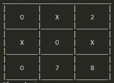
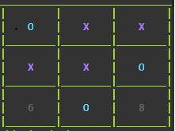
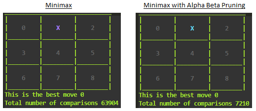

# TicTacToe-Minimax

An AI for Tic Tac Toe created using the minimax algorithm. Player interacts with the game engine through a graphical interface. Alpha-beta pruning will be added to the algorithm to increase its efficiency by reducing the total number of required comparisons.

# Terminal Version

First I decided to get a terminal based version of the game running. The controls for the board were managed by assigning each square on the grid a value, which will be selected to place a player's token there. Having made the implementation scable, the size of the boad can be increased to any value alongside the num of players, although I have limited this to six at the momen, since there are only six hard coded player tokens. 

 

The basic printing of the board was in just black and white, which I frankly found too dull, so I added some colour formating to the board and the tokens.

 

I added a variety of colours for the player tokens and made the game randomly assign one to each player at the start of each game. Now it looks better! 

After adding Minimax I noticed that the first few moves take the longest to compute due to the shear amount of game states to explore. Adding alpha beta pruning improved this a lot with upwards of 93% deduction in the number of comparisons in some cases. 

 

Despite this, for larger boards, even just for a 4x4, then intial couple of moves have comparisons in the magnitude of 10s of millions, so further optimisation is required. 

The next optimisation I made was to modify the checkBoard function to include a heuristic. This computed if the opponent can win on the next move and if so, it stops any further branching down that route and assigns a low score to that move to not pick it. This small heuristic dramatically reduced the time taken from 418 seconds on a 4x4 board, to 161 seconds. For the concurrent implementation, the time reduced from 302 seconds with no heuristic, to 97 seconds. 

Another optimisation I made was to add a transposition table to store the minimax values of different board states. This is implemented using a dictionary and loaded and saved using pickle. I needed a method of hashing the current board to assign it a value in the table. At first, I decided to use the inbuilt hash function because of its speed. Since the hash function cannot hash mutable types, I converted the 2D array storing the board to tuple before hashing. The performance improvement was again larger than expected. It took 15.3 seconds for the first move when building the move table, then the same move on a new game took 5.7 seconds. Although these times were much lower than previously, I still suspected playing the same move again should be instantaneous since it should require just once lookup. 

I found that the inbuilt hash function uses a different random seed for hashing on every instance of the interpreter. This meant it is not suitable for my purpose, so I explored other hashing algorithms in the hashlib library. I tried the md5 and sha256 algorithms but found the generated hash values were unnecessarily long for my use, so I made my own hash algorithm by concatenating all the characters on the board. This was possible since even the empty cells stored a number. Upon recreating and repopulating the move table using the new hashing function, I found it took 4.5 second to build the table then playing the same move took 0.003 seconds. Perfect!

